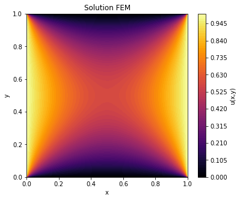
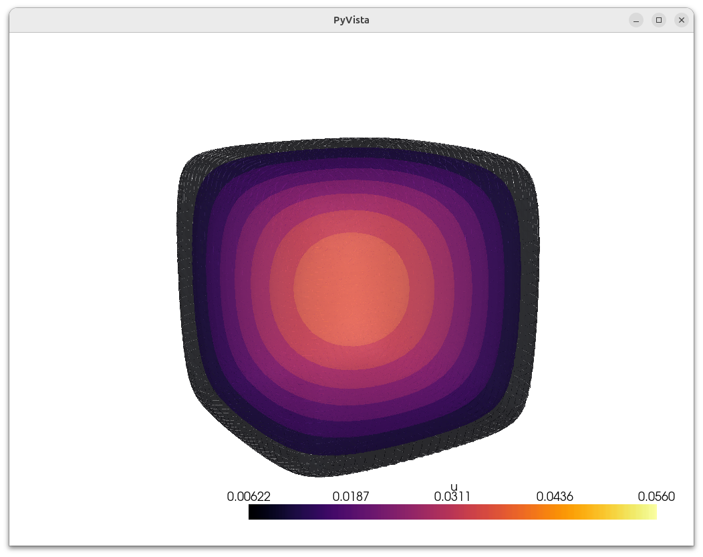

# Méthode des Éléments Finis pour l'Équation de Poisson

Ce repository présente un projet personnel de résolution de l'équation de Poisson en 1D, 2D et 3D par la méthode des éléments finis (MEF). L'objectif est de découvrir et expérimenter avec Python pour implémenter cette méthode.




## Description du Projet

Le projet traite la résolution de l'équation de Poisson en considérant quatres types de conditions aux limites :  

- Dirichlet  
- Neumann  
- Mixte Dirichlet-Neumann 
- Robin 

Les particularités pour chaque dimension sont les suivantes :  

- 1D : Résolution de l'équation sur une dimension.  
- 2D : Utilisation d'un maillage triangulaire régulier pour la résolution sur un domaine bidimensionnel rectangulaire.  
- 3D : Utilisation d'un maillage tétraédrique régulier pour la résolution dans l'espace sur un domaine parallélépipédique. Pour ce cas, une visualisation graphique de la solution est réalisée grâce à la librairie [PyVista](https://docs.pyvista.org/).  

## Installation et Utilisation (Cas 3D avec PyVista)

Pour la partie 3D, il est recommandé d'utiliser un environnement virtuel

### Création et Activation de l'Environnement Virtuel

```bash
python3 -m venv pyvista_env
source pyvista_env/bin/activate
pip install pyvista
```